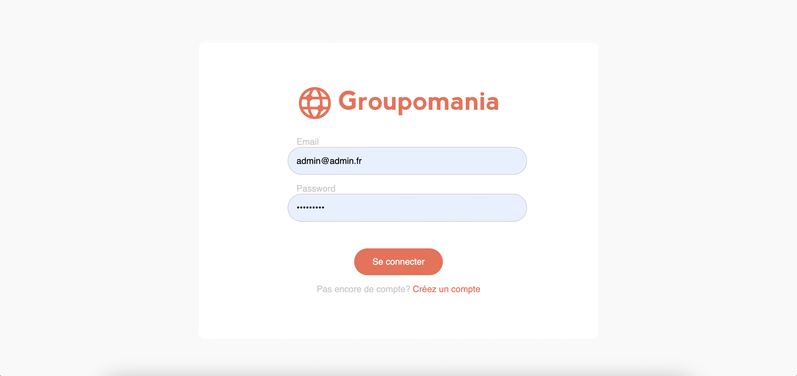
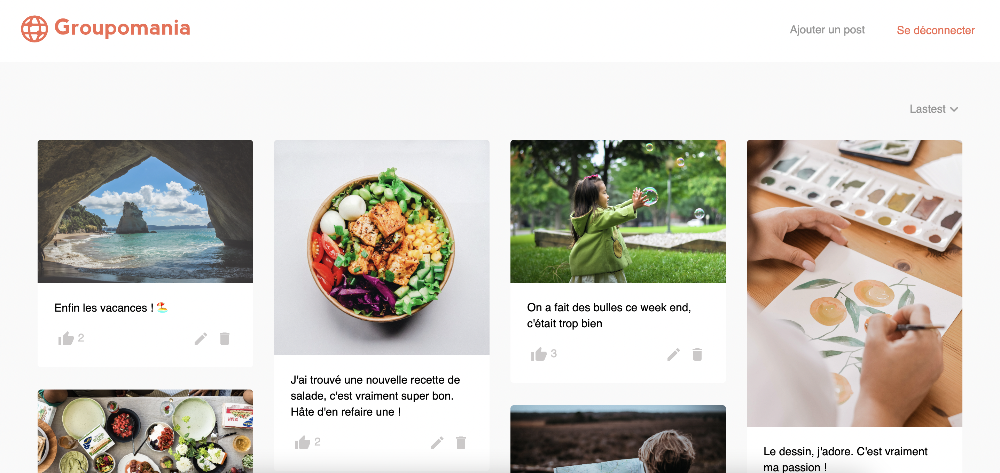
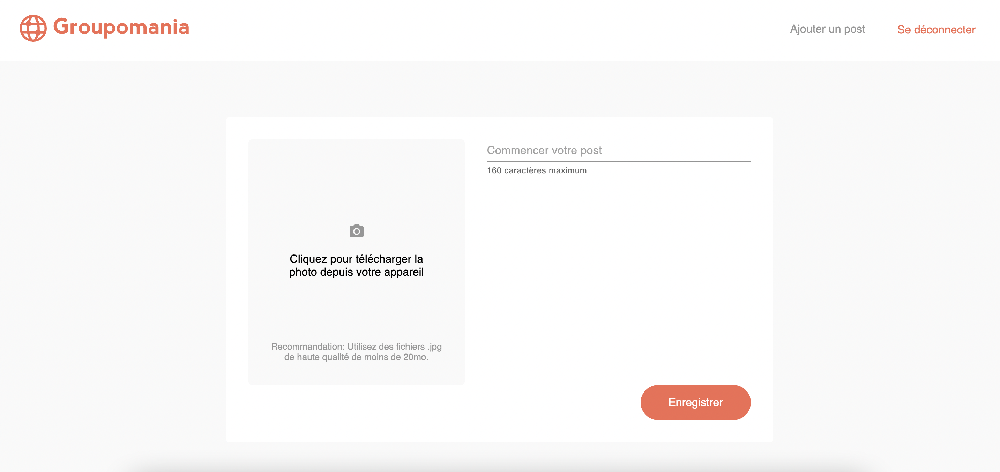

# Groupomania
## A social media app with React and Express

This is my solution to the last project of the OpenClassroom's web developer course. This challenge is  about creating a small social media app.

## Overview

### The challenge

You will need to use Express JS for the back end and React for the front. Your users should be able to:

- Login
- Signup
- See all posts on the homepage
- Create a new post 
- Update a post 
- Like a post 

### Screenshot

### Built with

- HTML5/CSS/SASS
- React JS
- Express JS

## Author

- Caroline Lienard (https://github.com/CarolineLienard)
- OpenClassrooms - (https://www.OpenClassrooms.com)
 
#### Note: If you are student, do your best to create your own solution, you got this 👍🏻
